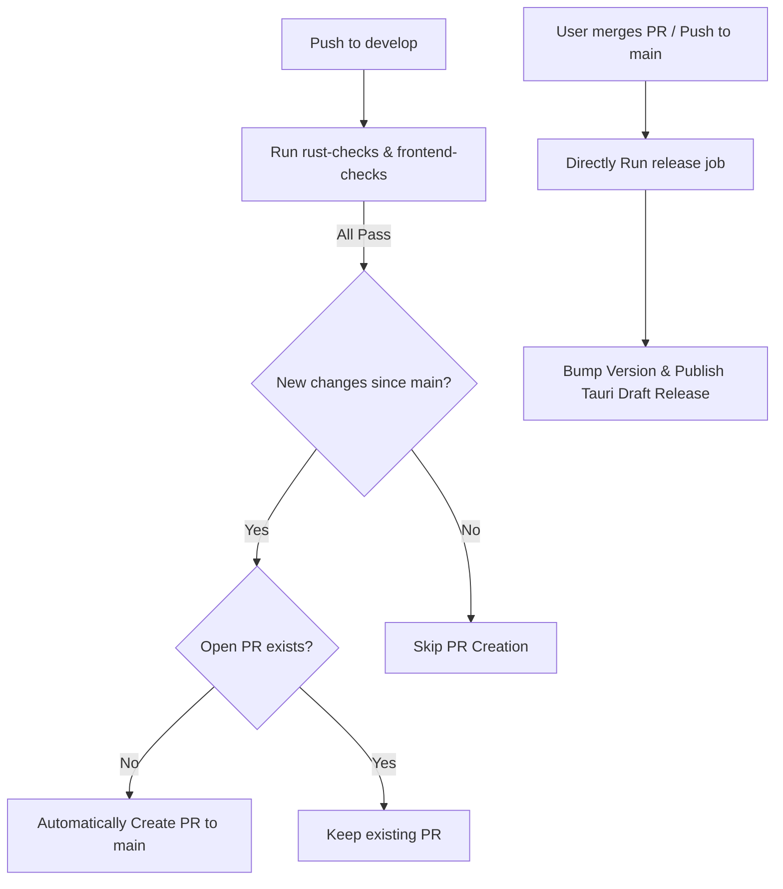

# Rust Scanner Workspace

## Project Overview
This project is a high-performance, multi-threaded file scanning tool written in Rust. It leverages a Cargo Workspace architecture to separate the core scanning engine from the user interface. The tool allows users to scan directories (or the entire filesystem) using regular expressions, with built-in patterns for Taiwanese ID numbers and top 10 surnames.

### Crate Architecture & Dependencies
The workspace separates consumer applications from the core library logic to ensure maximum reusability and boundaries. **Strict Rule: Consumer apps must depend on `scanner-core`, but the core must remain entirely agnostic of UI/CLI dependencies.**

```mermaid
graph TD
    subgraph Clients (Consumers)
        cli["rust-scanner-cli (Ratatui TUI)"]
        desktop["scanner-desktop (Vue 3 + Tauri 2 App)"]
    end
    
    subgraph Engine (Library)
        core["scanner-core (Fast Engine)"]
    end
    
    cli --> core
    desktop --> core
    
    style core fill:#3b82f6,stroke:#1d4ed8,stroke-width:2px,color:#fff
    style cli fill:#10b981,stroke:#047857,stroke-width:2px,color:#fff
    style desktop fill:#8b5cf6,stroke:#6d28d9,stroke-width:2px,color:#fff
```

1.  **`scanner-core` (Library)**: The core scanning engine. It utilizes the `ignore` crate for fast, multi-threaded directory traversal and the `regex` crate for pattern matching. It uses a flexible callback-based API (`on_match`) to support different UI frontends and a single-buffer read strategy to minimize memory allocations.
2.  **`rust-scanner-cli` (Binary)**: A Terminal User Interface (TUI) built with `ratatui` and `crossterm`. It provides an interactive way for users to select patterns and target directories.
3.  **`scanner-desktop` (Tauri App)**: A modern desktop application built with Tauri 2 and Vue 3. It provides a graphical interface for real-time scanning results and configuration.

---

## Building and Running

Ensure you have Rust, Cargo, and Node.js installed.

*   **To run the TUI application:**
    ```bash
    cd rust-scanner-workspace
    cargo run --bin rust-scanner-cli
    ```
*   **To run the Desktop application (Development):**
    ```bash
    cd rust-scanner-workspace/scanner-desktop
    npm install
    npm run tauri dev
    ```
*   **To build the workspace (Debug):**
    ```bash
    cd rust-scanner-workspace
    cargo build
    ```
*   **To build for Release (optimized performance):**
    ```bash
    cd rust-scanner-workspace
    cargo build --release
    ```
*   **To run code checks and linting:**
    ```bash
    cd rust-scanner-workspace
    cargo check
    cargo clippy
    cargo fmt
    ```

---

## Architecture & Integration

*   **Workspace Structure**: The root directory should ideally be kept clean of top-level `Cargo.toml` or source code files outside of the `rust-scanner-workspace` folder to maintain organizational clarity.
*   **Core Extraction**: The scanning logic (`scanner-core`) is completely decoupled from the UI. Other Rust applications (e.g., Web backends, GUI apps) can depend on it directly.
*   **Dependency Usage**:
    *   To use `scanner-core` in another local project, add the following to that project's `Cargo.toml`:
        ```toml
        scanner-core = { path = "../path/to/rust-scanner-workspace/scanner-core" }
        ```

---

## Development Conventions

*   **Rust Best Practices**: Follow standard Rust idioms. Prioritize Borrowing over Ownership where applicable, and handle errors gracefully using `Result<T, E>`.
*   **Error Handling in UI**: The CLI should not panic. TUI components must catch errors (like invalid Regex input) and display them interactively within the UI layout (e.g., in red text) rather than silently failing or crashing.
*   **Memory Efficiency**: The `scanner-core` should maintain its optimized single-buffer reading strategy (`line_buf.clear()`) inside loops instead of allocating new `String` instances per line to prevent GC overhead when scanning large codebases or logs.
*   **Formatting**: Always run `cargo fmt` before committing code. Code style is enforced by standard `rustfmt` rules.

---

## Testing & Fixtures

當實作新的 Rust 掃描規則（例如新增信用卡號掃描、個資掃描等）或修改核心邏輯時，您 **必須 (MUST)** 準備對應的測試資料與驗證邏輯：

1.  **準備測試資料 (Fixtures)**：
    *   請將測試用的檔案統一放置於 `rust-scanner-workspace/rust-scanner-cli/tests/data/` 目錄內。
    *   **文字測試 (`.txt`)**：包含預期會被掃描到的「正向條件 (Positive)」與不該被掃描到的「負向條件 (Negative)」。
    *   **二進位測試 (`.bin`)**：如果規則涉及檔案過濾，請準備二進位檔案以驗證掃描器是否能正確跳過或處理。
2.  **撰寫測試**：
    *   核心引擎邏輯的單元測試請寫在 `scanner-core/src/` 中。
    *   依賴實際檔案讀取的整合測試，請寫在對應的 `tests/` 目錄，並讀取 `tests/data/` 內的 Fixtures 進行驗證。
    *   完成後務必執行 `cargo test` 確保變更符合預期。

---

## Release & CI/CD 流程自動化

專案已配備基於 GitHub Actions 的 **「PR 導向快速發布與自動化 PR 機制」**。所有開發必須循以下生命週期執行：



### 1. 開發階段 (推送至 `develop` 分支)
*   **觸發機制**：任何推送到 `develop` 的 commit 或 Pull Request。
*   **動作**：自動平行跑 `rust-checks`（編譯、Clippy、測試）與 `frontend-checks`（Lint 語法、型別檢查、單元測試）。
*   **Auto-PR 建立**：
    *   如果驗證全部通過，CI 會自動檢查 `develop` 比起 `main` 分支是否有新提交。
    *   若有新代碼且目前**沒有**開啟中的 `develop` -> `main` PR，CI 會**自動建立一個全新 PR** 等待你審核。

### 2. 合併與發布階段 (合併至 `main` 分支)
*   **觸發機制**：當開發者手動點擊 GitHub PR 合併按鈕（或直接 Push 至 `main` / `master`），以及手動 Push 版本標籤（`v*`）。
*   **動作**：
    *   **跳過重複驗證**：因為在 PR 階段已完全驗證通過，合併後會直接進行 Release 打包，不浪費重複測試的 CI 時間。
    *   **自動計算語意化版號**：利用 `github-tag-action` 與 Conventional Commits 規範，依據你的 commit 類型（`feat`、`fix`、`BREAKING CHANGE`）自動推算出新版號並自動建立 Git Tag。
    *   **動態寫入版號**：CI 在編譯環境中會自動將新版號寫入專案根目錄的 `package.json`、`scanner-desktop` 的 `package.json` 與 `src-tauri/tauri.conf.json`。
    *   **Tauri 跨平台編譯**：在 Windows、macOS 和 Ubuntu 執行環境下平行編譯出各系統的桌面安裝檔（.msi, .dmg, .deb）。
    *   **精美分類發布說明**：使用 `gh` 終端指令，並配合專案設定的 `.github/release.yml` 模板，自動為你的 Draft Release 建立精美並帶有分類（🚀 Features, 🐛 Bug Fixes, 🧹 Chores, 📝 Documentation）的專業 Changelog。
