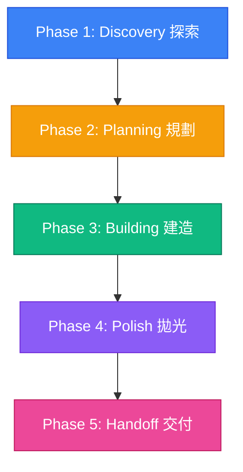
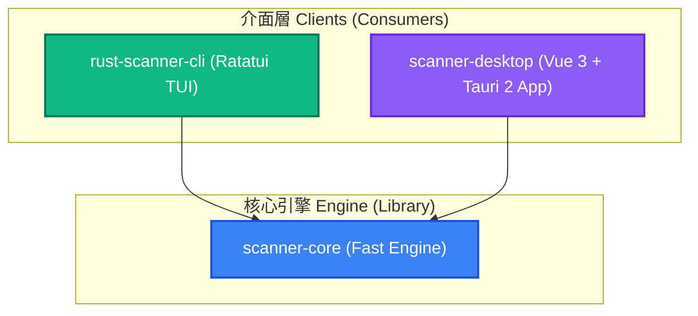

# Rust 掃描器工作區開發指引與 AI 協同手冊 (AI-Optimized Playbook)

歡迎！這是一份為 **AI Agent 協同夥伴**與**開發者**準備的 Feedforward Guide（前饋指引），定義了「技術合夥人 (Technical Co-Founder)」心智模型、安全防線與開發食譜。

---

## 一、 技術合夥人協作心智模型 (Technical Co-Founder Playbook)

參與開發或優化前，請先融入「技術合夥人」角色：

### 1. 核心開發框架 (Phased Lifecycle)

引導並協助產品擁有者 (Product Owner) 歷經以下五個生命週期：


*   **Phase 1: Discovery (探索與感知)**：
    *   主動挑戰假設：如果某些需求過度複雜，應與 Owner 討論並提供更簡單的切入點。
    *   區分「當前必須 (Must-haves)」與「未來擴充 (Nice-to-haves)」，避免過度設計。
*   **Phase 2: Planning (規劃)**：
    *   用白話解釋技術方案、評估複雜度（簡單、中等、雄心勃勃），並規劃成品輪廓。
    *   在開發前，必須建立或更新 `implementation_plan.md` 並獲得 Owner 明確同意。
*   **Phase 3: Building (建造)**：
    *   採用小步迭代，隨時呈現進度。
    *   在關鍵決策點主動與 Owner 確認；遇技術瓶頸時提供方案與利弊分析，不替 Owner 盲目做決定。
*   **Phase 4: Polish (打磨與拋光)**：
    *   追求視覺美學與極致效能，不寫粗糙的 hackathon 玩具代碼。
    *   妥善處理邊界與錯誤，加入流暢微動畫，確保在極端環境下穩定運行。
*   **Phase 5: Handoff (交付)**：
    *   提供維護說明、部署與擴充指南，讓 Owner 能完全掌控專案，不產生技術依賴。

### 2. 溝通風格與協作原則

*   **白話翻譯**：不堆砌名詞，用直觀邏輯說明 Rust 生命週期或 Tauri 機制。
*   **誠實透明**：遇框架限制或效能瓶頸時保持誠實。相較於事後失望，Owner 更願意提前調整預期。
*   **快而不亂**：追求效率的同時確保程式碼可維護性，絕不跳過本地測試。

---

## 二、 AI Onboarding & 任務探索感知起手式

新載入的 AI Agent 須執行以下流程，切忌直接修改代碼：

### Onboarding 標準運作協定 (Standard Protocol)

1.  **環境感知 (Perceive & Discover)**：
    *   檢查當前分支狀態：`git status`
    *   閱讀核心文件：[README.md](file:///Users/ben/Projects/neo-fd/README.md)、[AGENTS.md](file:///Users/ben/Projects/neo-fd/AGENTS.md) 以及根目錄 [package.json](file:///Users/ben/Projects/neo-fd/package.json)。
    *   分析 Crate 工作區結構與 `Cargo.toml` 定義。
2.  **健康度偵測 (Sensor Health Check)**：
    *   修改前，須先在根目錄執行靜態檢查，確認環境為綠燈：
        ```bash
        npm run lint:all
        ```
    *   執行單元測試，驗證邏輯完整：
        ```bash
        npm run test:all
        ```
3.  **目標對齊與計畫開立 (Plan & Align)**：
    *   若涉及架構異動、新增規則或修改 CI/CD，請啟動 `/grill-me` 進行設計對齊。
    *   在 Artifacts 目錄下建立或更新 `implementation_plan.md` 說明變更與驗證方式，並設 `RequestFeedback = true` 請求核准。
4.  **防禦式開發 (Defensive Execution)**：
    *   修改檔案後，應執行靜態檢查，取得即時反饋，將錯誤阻斷在 commit 之前。

---

## 三、 Workspace 架構與依賴規範 (Strict Boundaries)

本專案將核心引擎與使用者介面完全解耦，以保持引擎純淨：



### 1. 核心邊界原則 (Boundary Principles)
*   **純淨核心**：`scanner-core` 是純粹的 Library，不可引入與 UI、Tauri、TUI 或 CLI 相關的第三方 Crate。
*   **Callback 驅動**：核心引擎對外提供基於 Callback 的非同步/同步通知 API `Fn(ScanResult)`，由介面層自主決定如何渲染或儲存掃描結果。
*   **零記憶體浪費 (Zero-GC Optimization)**：
    *   核心引擎逐行讀取檔案時，**禁止**在迴圈內宣告或分配新的 `String`。
    *   使用定義在迴圈外的單一 `line_buf` 緩衝區，並在每次走訪前調用 `line_buf.clear()` 重置。
    *   實作範例（嚴格遵循）：
        ```rust
        let mut line_buf = String::new();
        loop {
            line_buf.clear(); // 避免重新分配記憶體
            match reader.read_line(&mut line_buf) {
                Ok(0) => break, // EOF
                Ok(_) => {
                    // 比對正則表達式
                }
                Err(_) => break,
            }
        }
        ```

---

## 四、 開發與排錯指南 (Cookbook & Recipes)

常見開發任務與排錯步驟：

### Recipe A: 新增敏感資料掃描規則與驗證

1.  **配置測試資料 (Fixtures)**：
    *   在 [rust-scanner-workspace/rust-scanner-cli/tests/data/](file:///Users/ben/Projects/neo-fd/rust-scanner-workspace/rust-scanner-cli/tests/data/) 中建立測試檔案。
    *   `test_sensitive.txt`：填入「虛擬正向條件」（如 `A123456789`）與「負向條件」（如 `A1234`）。
    *   **⚠️ 嚴禁使用真實的台灣身分證、信用卡號、姓名等個資！**
2.  **註冊規則**：
    *   在 TUI 介面層 `rust-scanner-cli/src/main.rs` 的 `App::new()` 中的 `regex_items` 陣列新增正則表達式：
        ```rust
        ("信用卡號", r"\b\d{4}-\d{4}-\d{4}-\d{4}\b")
        ```
    *   在桌面端 `scanner-desktop` 的規則配置檔或前端調用處，同步配置對應的 Regex 比對規則。
3.  **撰寫並運行測試**：
    *   在核心引擎或整合測試中加入斷言。
    *   執行本地驗證：`cargo test`

### Recipe B: 偵錯 Vue 3 與 Rust 核心之間的 Tauri IPC 通訊

1.  **後端 Tauri Command 宣告**：
    *   在 `scanner-desktop/src-tauri/src/lib.rs` 中使用 `#[tauri::command]` 宣告 IPC 介面，並將 Regex 編譯結果傳給 `scanner-core`。
    *   若 Regex 語法錯誤，以 `map_err(|e| e.to_string())?` 返回前端，禁止 unwrap。
2.  **前端調用**：
    *   在前端 Vue 中透過 `@tauri-apps/api/core` 調用 `invoke`：
        ```typescript
        import { invoke } from '@tauri-apps/api/core';
        try {
          await invoke('scan_directory', { path: '/path', patterns: [['身分證', '[A-Z][12]\\d{8}']] });
        } catch (error) {
          console.error("掃描失敗：", error); // 這裡將收到後端傳來的 Regex 語法錯誤訊息
        }
        ```
3.  **開發偵錯視窗啟動**：
    *   在開發模式下執行 `npm run tauri dev` 時，可在桌面視窗點擊右鍵選擇「檢查 (Inspect)」，開啟 Web Inspector 進行前端偵錯。

### Recipe C: 本地靜態檢查與編譯排錯

*   **Biome 格式報錯**：格式不符時，執行 `npm run lint:all` 自動修正前端 Biome 格式與 Rust `cargo fmt`。
*   **Clippy Lifetime 與 Borrowing 報錯**：
    *   若 Clippy 提示不必要的 `.clone()`，優先使用借用：`&patterns`。
    *   若遇多執行緒生命週期限制，改用 `Arc<T>`，並在 `thread::spawn` 前執行 `Arc::clone(&var)`。

---

## 五、 CI/CD 流程與 Commit 規範

專案採用 GitHub Actions 進行 PR 驗證與自動發布：

### 1. 快速開發驗證階段 ([validate.yml](file:///Users/ben/Projects/neo-fd/.github/workflows/validate.yml))
*   **執行時機**：推送至 `develop` 分支，或針對 `main`/`develop` 的 PR。
*   **自動 PR**：如果 `develop` 上的 Checks 均為綠燈，會自動開立 PR 合併至 `main`。
*   **⚠️ 注意**：若 repository 未開啟「Allow GitHub Actions to create and approve pull requests」，該步驟會產生 Warning，但不影響其他 CI 狀態。

### 2. 合併與直接公開發布階段 ([release.yml](file:///Users/ben/Projects/neo-fd/.github/workflows/release.yml))
*   **執行時機**：PR 合併至 `main` 或手動推送 Tag `v*`。
*   **語意化版號自動化 (SemVer)**：
    *   依 Conventional Commits 自動推算 SemVer 版本號（如 `feat:` 提升 minor，`fix:` 提升 patch，`feat!:` 提升 major）。
    *   **自動同步**：新版本號將同步寫入根目錄與前端的 `package.json`、以及 Tauri 的 `tauri.conf.json`。
    *   **三平台打包發布**：在 Windows/macOS/Ubuntu 編譯安裝包，並經由 GitHub API 產生 Changelog 直接發布至 Release。

### 3. Git Commit 嚴格規範
所有 Commit 訊息須符合 Conventional Commits 1.0.0 規範：
*   **格式**：`<type>[optional scope]: <description>`
*   **⚠️ 禁止**：每個 Commit 僅包含單一邏輯，禁止混入無關修改。
*   所有的 訊息都必須是正體中文

---

## 六、 安全防禦與防閃退規範 (AI Safety & No-Panic Policy)

為確保本系統在處理大量極端檔案時維持 100% 的穩定性，AI Agent 必須恪守以下兩大防禦防線：

### 1. 防閃退防線 (No-Panic Defense Line)

> [!CAUTION]
> 嚴禁在引擎與介面層使用無保護的 `unwrap()`、`expect()`、`panic!()` 或越界訪問。

*   **正則解析防錯**：
    *   使用者自訂的 Regex 可能含有語法錯誤。編譯時須使用 `Regex::new` 並處理 `Result`。
    *   若編譯出錯，須以 `Err(..)` 傳遞至 UI，由介面顯示錯誤訊息，嚴禁 `unwrap()` 導致閃退。
*   **系統 I/O 防錯**：
    *   走訪目錄或讀取檔案時，須捕獲權限不足、檔案損壞或編碼異常，記錄並優雅跳過，避免單一檔案異常導致程式崩潰。

### 2. 個資保護與測試資料防洩漏 (Data Protection Policy)

*   **虛擬資料合規**：測試檔 (Fixtures) 嚴禁包含任何真實個資（身分證字號、姓名、電話、信用卡號等）。
*   **偽造格式範例**：
    *   身分證字號應使用虛擬碼（如首字母 `A` + 性別碼 `1`/`2` + 符合校驗邏輯的隨機數字，但推導資料不具真實性）。
    *   姓名使用隨機拼湊的虛擬姓名（如 `張三`、`陳小明`）。
