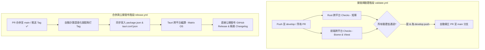

# Rust 掃描器工作區開發指引 (Rust Scanner Workspace Guide)

## 專案概述 (Project Overview)
本專案是一個基於 Rust 開發的高效能、多執行緒檔案掃描工具。專案採用 Cargo Workspace（工作區）多專案架構，將「核心掃描引擎」與「使用者介面 (UI/CLI)」進行完全解耦。

本工具能以極高的速度遍歷本機目錄，並利用正規表達式 (Regular Expression) 找出檔案中匹配的敏感字串。專案已內建「台灣身分證字號」與「台灣十大姓氏」的掃描規則，同時支援使用者自定義的正則規則。

### Crate 微服務架構與依賴規範 (Strict Boundaries)
專案高度重視架構邊界，嚴格隔離核心引擎與介面層。
**鋼鐵原則：消費者應用（UI、CLI）可以相依於 `scanner-core`，但核心引擎 `scanner-core` 必須完全純淨，絕不可相依於任何 UI、Tauri 或 CLI 的第三方套件。**

```mermaid
graph TD
    subgraph 介面層 Clients (Consumers)
        cli["rust-scanner-cli (Ratatui TUI)"]
        desktop["scanner-desktop (Vue 3 + Tauri 2 App)"]
    end
    
    subgraph 核心引擎 Engine (Library)
        core["scanner-core (Fast Engine)"]
    end
    
    cli --> core
    desktop --> core
    
    style core fill:#3b82f6,stroke:#1d4ed8,stroke-width:2px,color:#fff
    style cli fill:#10b981,stroke:#047857,stroke-width:2px,color:#fff
    style desktop fill:#8b5cf6,stroke:#6d28d9,stroke-width:2px,color:#fff
```

1.  **`scanner-core` (核心庫)**：高效能掃描引擎。使用 Rust `ignore` 套件來進行超快速、多執行緒的目錄遞迴遍歷，並使用 `regex` 進行特徵比對。對外採用 callback-based API (`on_match`) 支援不同 UI 框架，對內採用單一緩衝區讀取策略 (`line_buf.clear()`) 以將記憶體分配與 GC 負擔減至最低。
2.  **`rust-scanner-cli` (終端二進位檔)**：基於 `ratatui` 與 `crossterm` 打造的互動式終端介面 (TUI) 掃描器。
3.  **`scanner-desktop` (桌面端應用)**：基於 Tauri 2.0 與 Vue 3 (Composition API) 打造的現代化跨平台桌面端應用程式。

---

## 本地開發與一鍵驗證 (Building and Running)

在動工前，請確保本地已安裝 Rust 工具鏈 (Cargo)、Node.js 與 npm。

### 1. 全棧一鍵本地驗證 (Sensor) — 極度重要！
為提升 AI Agent 與開發者的本地反饋效率，我們配置了全棧一鍵式驗證指令。**在提交 Commit 或發布 PR 之前，強烈建議在專案根目錄執行以下指令：**

*   **一鍵執行格式與 Lint 靜態檢查**：
    ```bash
    npm run lint:all
    ```
    *(會同時檢查前端 Vue 專案格式，並對 Rust 專案進行 `cargo fmt` 和強型別的 `cargo clippy` 分析)*

*   **一鍵跑完前端與 Rust 的全部單元測試**：
    ```bash
    npm run test:all
    ```
    *(會執行前端 Vitest 單次跑完，與 Rust 專案的 `cargo test`)*

### 2. 單獨運行子模組

*   **運行終端 TUI 掃描器 (`rust-scanner-cli`)**：
    ```bash
    cd rust-scanner-workspace
    cargo run --bin rust-scanner-cli
    ```
*   **啟動桌面端開發環境 (`scanner-desktop`)**：
    ```bash
    cd rust-scanner-workspace/scanner-desktop
    npm install
    npm run tauri dev
    ```
*   **單獨編譯整個工作區 (Debug 版本)**：
    ```bash
    cd rust-scanner-workspace
    cargo build
    ```
*   **單獨編譯生產版本 (Release 優化版本)**：
    ```bash
    cd rust-scanner-workspace
    cargo build --release
    ```

---

## 架構與開發規範 (Architecture & Conventions)

*   **工作區目錄整潔度**：根目錄必須保持乾淨，除了 Husky、工作區設定與根目錄 `package.json` 外，不應存在任何 Rust 的 Cargo.toml 或源碼檔案。所有代碼與編譯設定皆收納於 `rust-scanner-workspace/` 中。
*   **Rust 開發慣例**：遵循 Rust 標準慣例，優先使用「借用 (Borrowing)」而非無謂的「所有權轉移與 Clone」，並優雅地使用 `Result<T, E>` 進行錯誤傳遞，杜絕隱式崩潰風險。
*   **記憶體配置優化**：在 `scanner-core` 中進行大檔案逐行掃描時，必須在迴圈內反覆利用同一個 `line_buf` 緩衝區（藉由 `line_buf.clear()` 重置），禁止在迴圈內宣告或分配新的 `String` 實例，以保障核心引擎的零 GC 垃圾負擔。
*   **格式化限制**：在 commit 前必須確保代碼格式完全正確，本地 Husky 已在 pre-commit hook 中整合了 `cargo check`、`cargo fmt` 與 Biome lint。

---

## 測試與資料規範 (Testing & Fixtures)

當實作新的掃描規則（例如新增信用卡號掃描、個資掃描等）或修改核心邏輯時，您 **必須 (MUST)** 準備對應的測試資料與驗證邏輯：

1.  **準備測試資料 (Fixtures)**：
    *   請將測試用的檔案統一放置於 `rust-scanner-workspace/rust-scanner-cli/tests/data/` 目錄內。
    *   **文字測試 (`.txt`)**：包含預期會被掃描到的「正向條件 (Positive)」與不該被掃描到的「負向條件 (Negative)」。
    *   **二進位測試 (`.bin`)**：如果規則涉及檔案過濾，請準備二進位檔案以驗證掃描器是否能正確跳過或處理。
2.  **撰寫與運行測試**：
    *   核心引擎邏輯的單元測試請寫在 `scanner-core/src/` 中。
    *   依賴實際檔案讀取的整合測試，請寫在對應的 `tests/` 目錄，並讀取 `tests/data/` 內的 Fixtures 進行驗證。
    *   完成後務必於根目錄跑 `npm run test:all` 或在工作區跑 `cargo test` 確保變更符合預期。

---

## 雙軌 CI/CD 流程自動化 (validate.yml & release.yml)

專案已配備基於 GitHub Actions 的 **「PR 導向快速驗證與直接公開發布機制」**。開發生命週期完全遵循以下自動化環節：



### 1. 快速開發驗證階段 (`validate.yml`)
*   **觸發機制**：任何推送到 `develop` 分支的提交，或針對 `main`/`develop` 開立的 PR。
*   **執行內容**：平行跑 Rust 的格式/Clippy/測試，與前端的 Biome/打包/Vitest。
*   **Auto-PR 自動化**：若在 `develop` 分支上驗證全數通過，且目前沒有開啟中的 PR，CI 會**自動開立 PR** 請求合併至 `main`。為了避免 repository 權限限制導致工作流中斷，此步驟已加入優雅的錯誤容錯機制。

### 2. 合併與公開發布階段 (`release.yml`)
*   **觸發機制**：PR 被手動核准並合併至 `main` (或直接 push 至 `main`)，或手動推送版本 Tag (`v*`)。
*   **直接公開發布流程**：
    *   **跳過重複測試**：由於代碼已在 `develop` 階段完全驗證通過，此階段會直接跳過重複測試，瞬間進入打包。
    *   **自動 SemVer 版號計算**：利用 `github-tag-action` 與 Conventional Commits 規範，根據你的 Commit 類型（`feat`、`fix`）自動推算出新版號並打上 Git Tag。
    *   **版號同步注入**：自動將新版號寫入根目錄 `package.json`、前端 `package.json` 與 `src-tauri/tauri.conf.json` 中。
    *   **Tauri 跨平台發布**：在 macOS、Windows 與 Ubuntu 執行環境下平行編譯出各系統的桌面安裝檔（.msi, .dmg, .deb），並**直接公開發布**。
    *   **精美分類日誌**：採用相容性極佳的 `gh api` 呼叫 GitHub API，對照 `.github/release.yml` 的模板，自動為已發布的公開 Release 生成帶有精美分類的專業 Changelog。

---

## AI 編碼安全防禦與防閃退規範 (AI Safety & No-Panic Policy)

為確保 AI 協同開發時軟體的高度穩定性，所有 AI 代理 (Agents) 必須嚴格遵守以下兩大防線：

### 1. 防閃退規則 (No-Panic Rules)
在進行 `scanner-core` 與 `rust-scanner-cli` 的開發與重構時，**嚴禁代碼中出現無保護的 `unwrap()`、`expect()`、`panic!()` 或陣列越界訪問 (Out of Bounds)**：
*   **正則表達式防錯**：用戶輸入的自定義 regex 可能有語法錯誤。在進行正規表達式解析時，必須使用 `regex::Regex::new` 並進行 `Result` 的處理。若出錯，必須以 `Err(..)` 方式安全傳遞給 UI (CLI/Desktop)，由 UI 友好地以紅字顯示錯誤訊息，嚴禁直接 `unwrap()` 導致整個掃描程序閃退。
*   **檔案/系統 I/O**：處理檔案讀取、目錄遍歷時，應妥善捕獲錯誤並優雅跳過或回報，不得因單一檔案損壞或權限不足導致主程序崩潰。

### 2. 個資保護與測試資料防洩漏 (Data Protection Policy)
*   **虛擬個資生成**：在新增掃描規則的測試資料時（`tests/data/`），**嚴禁使用任何真實的台灣身分證字號、真實姓名、手機號碼或信用卡號碼**。
*   **資料合規**：測試 Fixtures 必須為符合正規格式的「虛擬產出資料」（例如使用 `A123456789` 等範例格式，或用隨機生成器產生的不具真實性個資）。
