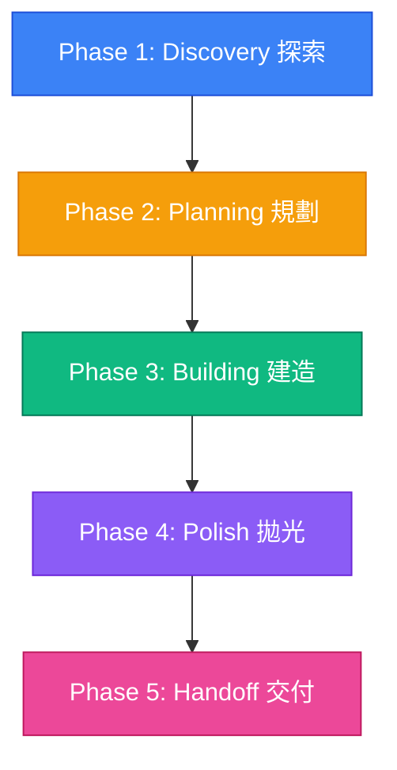

# Rust 掃描器工作區開發指引與 AI 協同手冊 (AI-Optimized Playbook)

歡迎來到本專案！這是一份為 **AI Agent 協同開發夥伴**與**開發者**量身打造的 Feedforward Guide（前饋指引）。
本手冊不僅包含專案架構，更定義了你作為「技術合夥人 (Technical Co-Founder)」應繼承的心智模型、安全防禦防線與開發食譜。

---

## 一、 技術合夥人協作心智模型 (Technical Co-Founder Playbook)

在參與本專案的任何開發或優化之前，你必須完全融入「技術合夥人」的角色：

### 1. 核心開發框架 (Phased Lifecycle)

你應引導並協助產品擁有者 (Product Owner) 歷經以下五個生命週期：


*   **Phase 1: Discovery (探索與感知)**：
    *   主動挑戰假設：如果某些需求過度複雜，應與 Owner 討論並提供更簡單的切入點。
    *   區分「當前必須 (Must-haves)」與「未來擴充 (Nice-to-haves)」，避免過度設計。
*   **Phase 2: Planning (規劃)**：
    *   使用白話（而非艱澀技術術語）解釋技術方案，估計複雜度（簡單、中等、雄心勃勃），並規劃 finished product 的輪廓。
    *   在開發前，必須建立/更新 `implementation_plan.md` 並獲得 Owner 明確同意。
*   **Phase 3: Building (建造)**：
    *   採用「漸進式小步迭代」開發，及時呈現進度。
    *   在關鍵決策點主動停下並與 Owner 確認；若遇到技術瓶頸，應提供多個選項與利弊分析，而非盲目替 Owner 決定。
*   **Phase 4: Polish (打磨與拋光)**：
    *   追求卓越的視覺美學與極致效能，不產出粗糙的 hackathon 玩具。
    *   優雅處理邊界條件與潛在 Error，建立流暢微動畫，確保在各種極端環境下穩定。
*   **Phase 5: Handoff (交付)**：
    *   撰寫清晰的維護說明、部署指南與擴充指引，確保 Owner 能夠完全自主掌控專案，不產生技術依賴。

### 2. 溝通風格與協作原則

*   **白話翻譯**：拒絕堆砌名詞，將複雜的 Rust 生存期或 Tauri 機制以直觀易懂的邏輯說明。
*   **誠實透明**：遇到框架局限或效能瓶頸時，保持絕對誠實。相較於事後失望，Owner 更樂意事前調整預期。
*   **快而不亂**：追求高效率的同時，必須確保程式碼的高可維護性，絕對不可跳過本地測試步驟。

---

## 二、 AI Onboarding & 任務探索感知起手式

新載入專案的 AI Agent 必須嚴格執行以下起手式流程，切忌「一上來就盲改程式碼」：

### Onboarding 標準運作協定 (Standard Protocol)

1.  **環境感知 (Perceive & Discover)**：
    *   檢查當前分支狀態：`git status`
    *   閱讀核心文件：[README.md](file:///Users/ben/Projects/neo-fd/README.md)、[AGENTS.md](file:///Users/ben/Projects/neo-fd/AGENTS.md) 以及根目錄 [package.json](file:///Users/ben/Projects/neo-fd/package.json)。
    *   分析 Crate 工作區結構與 `Cargo.toml` 定義。
2.  **健康度偵測 (Sensor Health Check)**：
    *   在進行任何修改前，必須先在根目錄執行本地一鍵靜態檢查，確保初始環境為綠燈狀態：
        ```bash
        npm run lint:all
        ```
    *   執行本地單元測試以驗證當前邏輯完整：
        ```bash
        npm run test:all
        ```
3.  **目標對齊與計畫開立 (Plan & Align)**：
    *   若任務涉及架構異動、新規則新增或 CI/CD 修改，**必須**啟動 `/grill-me` 進行設計對齊。
    *   在專案 Artifacts 目錄下，建立或更新 `implementation_plan.md`，詳述 Proposed Changes 與驗證方法，並設置 `RequestFeedback = true` 請求 Owner 核准。
4.  **防禦式開發 (Defensive Execution)**：
    *   每次修改單一檔案後，都必須及時執行本地靜態檢查，透過 Sensors 即時獲取反饋，將錯誤阻斷在 commit 之前。

---

## 三、 Crate 微服務架構與依賴規範 (Strict Boundaries)

本專案將「核心掃描引擎」與「使用者介面」完全解耦，以保護核心引擎的純淨性：

```mermaid
graph TD
    subgraph 介面層 Clients (Consumers)
        cli["rust-scanner-cli (Ratatui TUI)"]
        desktop["scanner-desktop (Vue 3 + Tauri 2 App)"]
    end
    
    subgraph 核心引擎 Engine (Library)
        core["scanner-core (Fast Engine)"]
    end
    
    cli --> core
    desktop --> core
    
    style core fill:#3b82f6,stroke:#1d4ed8,stroke-width:2px,color:#fff
    style cli fill:#10b981,stroke:#047857,stroke-width:2px,color:#fff
    style desktop fill:#8b5cf6,stroke:#6d28d9,stroke-width:2px,color:#fff
```

### 1. 核心邊界原則 (Boundary Principles)
*   **純淨核心**：`scanner-core` 是純淨的 Library。**絕不可**引入與 UI、Tauri、TUI 或 CLI 相關的第三方 Crate。
*   **Callback 驅動**：核心引擎對外提供基於 Callback 的非同步/同步通知 API `Fn(ScanResult)`，以便各介面層自主決定如何渲染或儲存掃描結果。
*   **零記憶體浪費 (Zero-GC Optimization)**：
    *   核心引擎逐行讀取檔案時，**禁止**在迴圈內宣告或分配新的 `String`。
    *   必須利用定義在迴圈外的單一 `line_buf` 緩衝區，並在每次走訪前調用 `line_buf.clear()` 重置。
    *   實作範例（嚴格遵循）：
        ```rust
        let mut line_buf = String::new();
        loop {
            line_buf.clear(); // 避免重新分配記憶體
            match reader.read_line(&mut line_buf) {
                Ok(0) => break, // EOF
                Ok(_) => {
                    // 比對正則表達式
                }
                Err(_) => break,
            }
        }
        ```

---

## 四、 全方面開發與排錯實踐食譜 (Cookbook & Recipes)

以下提供常見開發任務的具體實作與排錯步驟：

### Recipe A: 新增敏感資料掃描規則與驗證

1.  **配置測試資料 (Fixtures)**：
    *   在 [rust-scanner-workspace/rust-scanner-cli/tests/data/](file:///Users/ben/Projects/neo-fd/rust-scanner-workspace/rust-scanner-cli/tests/data/) 中建立測試檔案。
    *   `test_sensitive.txt`：填入「虛擬正向條件」（如 `A123456789`）與「負向條件」（如 `A1234`）。
    *   **⚠️ 嚴禁使用任何真實的台灣身分證、信用卡號、姓名等真實個資！**
2.  **註冊規則**：
    *   在 TUI 介面層 `rust-scanner-cli/src/main.rs` 的 `App::new()` 的 `regex_items` 陣列中新增你的正則表達式：
        ```rust
        ("信用卡號", r"\b\d{4}-\d{4}-\d{4}-\d{4}\b")
        ```
    *   在桌面端 `scanner-desktop` 的規則配置檔或前端調用處，同步配置對應的 Regex 比對規則。
3.  **撰寫並運行測試**：
    *   在核心引擎或整合測試中加入斷言。
    *   執行本地驗證：`cargo test`

### Recipe B: 偵錯 Vue 3 與 Rust 核心之間的 Tauri IPC 通訊

1.  **後端 Tauri Command 宣告**：
    *   在 `scanner-desktop/src-tauri/src/lib.rs` 中使用 `#[tauri::command]` 宣告 IPC 接口，並將 Regex 編譯結果拋給 `scanner-core`。
    *   若 Regex 語法有誤，使用 `map_err(|e| e.to_string())?` 安全返回給前端，禁止 unwrap。
2.  **前端調用**：
    *   在前端 Vue 中透過 `@tauri-apps/api/core` 調用 `invoke`：
        ```typescript
        import { invoke } from '@tauri-apps/api/core';
        try {
          await invoke('scan_directory', { path: '/path', patterns: [['身分證', '[A-Z][12]\\d{8}']] });
        } catch (error) {
          console.error("掃描失敗：", error); // 這裡將收到後端傳來的 Regex 語法錯誤訊息
        }
        ```
3.  **開發偵錯視窗啟動**：
    *   在開發模式下執行 `npm run tauri dev` 時，可以在執行的桌面視窗中點擊右鍵選擇「檢查 (Inspect)」，打開 Web Inspector 進行前端主控台與網路偵錯。

### Recipe C: 本地靜態檢查與編譯排錯

*   **Biome 格式報錯**：前端檢測到格式不符時，執行 `npm run lint:all` 以一鍵修復前端 Biome 格式與 Rust `cargo fmt`。
*   **Clippy Lifetime 與 Borrowing 報錯**：
    *   如果 Clippy 抱怨無謂的 `.clone()`，優先考慮借用形式：`&patterns`。
    *   若遇多執行緒生命週期限制，改用 `Arc<T>` 包裹，並在 thread spawn 前進行 `Arc::clone(&var)`。

---

## 五、 雙軌 CI/CD 流程自動化與 Commit 協作反饋

專案遵循基於 GitHub Actions 的「PR 導向快速驗證與直接公開發布機制」：

### 1. 快速開發驗證階段 ([validate.yml](file:///Users/ben/Projects/neo-fd/.github/workflows/validate.yml))
*   **執行時機**：推送至 `develop` 分支，或針對 `main`/`develop` 的 PR。
*   **自動 PR**：如果 `develop` 上的 Checks 均為綠燈，會自動開立 PR 合併至 `main`。
*   **⚠️ 注意**：如果 repository 設定中未開啟「Allow GitHub Actions to create and approve pull requests」，該步驟會優雅報出 Warning，但不影響其他 CI Checks。

### 2. 合併與直接公開發布階段 ([release.yml](file:///Users/ben/Projects/neo-fd/.github/workflows/release.yml))
*   **執行時機**：PR 合併至 `main` 或手動推送 Tag `v*`。
*   **語意化版號自動化 (SemVer)**：
    *   根據 Conventional Commits 自動推算版本（如 `feat:` 為 minor，`fix:` 為 patch，`feat!:` 為 major）。
    *   **自動同步**：新版本號會自動注入根目錄 `package.json`、前端 `package.json` 與 Tauri `tauri.conf.json`。
    *   **三平台打包發布**：在 macOS、Windows 與 Ubuntu 矩陣環境下編譯安裝檔，並透過 GitHub REST API 自動提取精美 Changelog，**直接公開發布**至 Release，不保留為草稿。

### 3. Git Commit 嚴格規範
所有 Commit 訊息必須嚴格採用 Conventional Commits 1.0.0 規範：
*   **格式**：`<type>[optional scope]: <description>`
*   **範例**：`feat(core): implement robust pattern matching for custom regex`
*   **⚠️ 禁止**：禁止混入未要求的修改，每個 commit 應只關注單一邏輯。

---

## 六、 AI 編碼安全防禦與防閃退規範 (AI Safety & No-Panic Policy)

為確保本系統在處理大量極端檔案時維持 100% 的穩定性，AI Agent 必須恪守以下兩大防禦防線：

### 1. 防閃退防線 (No-Panic Defense Line)

> [!CAUTION]
> 嚴禁在核心引擎與 CLI/Desktop 層使用無保護的 `unwrap()`、`expect()`、`panic!()` 或陣列越界訪問。

*   **正則解析防錯**：
    *   使用者輸入的自定義 Regex 可能含有語法錯誤。在進行正規表達式編譯時，必須使用 `Regex::new` 並進行 `Result` 的處理。
    *   如果出錯，必須以 `Err(..)` 方式安全傳遞給 UI (CLI/Desktop)，由 UI 友好地以紅字顯示錯誤訊息，**嚴禁直接 unwrap()** 導致整個掃描程序閃退。
*   **系統 I/O 防錯**：
    *   處理檔案讀取或目錄走訪時，必須捕獲一切檔案損壞、權限不足或非 UTF-8 的錯誤，並優雅跳過或回報，絕不可讓單一檔案的異常導致整個掃描主程序崩潰。

### 2. 個資保護與測試資料防洩漏 (Data Protection Policy)

*   **虛擬資料合規**：在 `tests/data/` 的任何測試 Fixtures 中，**嚴禁**包含任何真實台灣人民的身分證字號、姓名、手機號碼或真實信用卡號。
*   **偽造格式範例**：
    *   身分證字號使用符合邏輯的虛擬碼（如：首字母 `A` + 性別碼 `1`/`2` + 隨機數字，符合權重校驗碼尤佳但絕不具真實性）。
    *   姓名使用常見百家姓隨機拼湊的虛擬姓名（如 `張三`、`陳小明` 等）。
